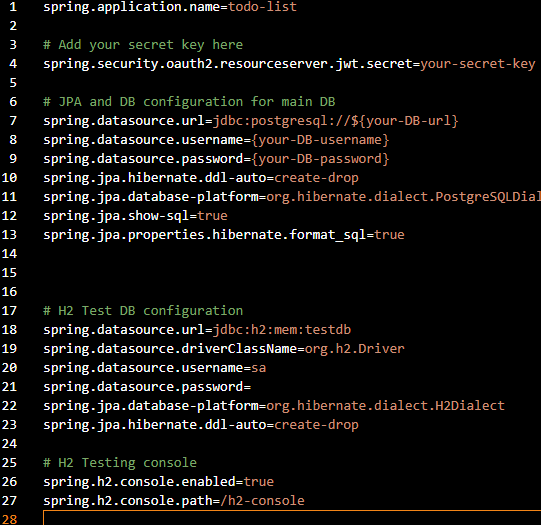

# Todo List Project

## Simple Full-Stack Application For Managing Projects And Tasks

This project utilizes a **Spring Boot REST API** that is secured with **Spring Security** and a basic frontend with **vanilla JS, HTML, and CSS**!

### How It Works

- Users must first create an account on the register page.
- After registering, users will now be able to log in.
- Logged in users will then be able **create, update, and manage** their own projects and tasks.
- All Users' projects and tasks are persisted in a relational database and retrieved upon login.

## Key Features

- User Authentication (**JWT-Based Authentication**)
- Secured REST API endpoints with Spring Security
- Ability to perform CRUD operations on projects and tasks
- Manage tasks inside each project
- Relational Database where users, projects, and tasks are persisted
- Responsive frontend using vanilla JS, HTML, and CSS

## How To Install

** `applications.properties` and `url.js` files are gitignored! Will have to fill in own credentials! **

### Backend

- Clone repo
- Open the backend folder in a separate workspace
- Run this command in your terminal

```bash
cp application-example.properties application.properties
```

- Find the `applications.properties` file in the resources folder
- Fill in the `applications.properties` file with your credentials

  

- Find the `TodoListApplication.java` file and run the project

### Frontend

- Open the docs folder in a separate workspace
- Run this command in your terminal

```bash
cp urlExample.js url.js
```

- Open the `login.html` file in your browser

## Live Demo

** Backend is served with Render (Free Option) so it might run slow!**

You can try the app live on GitHub Pages:
[Todo List App](https://jhairs2.github.io/java-todo-list/)
